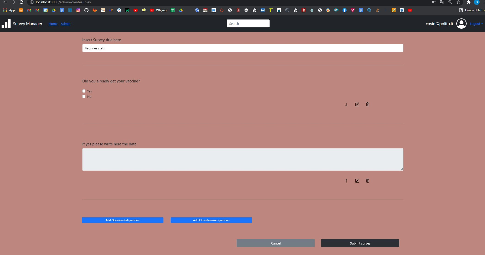

# Exam #1: "Survey"

# [Exam assignment](https://elite.polito.it/files/courses/01TXYOV/2021/exam/WA1_exam1_survey_FINAL.pdf)

## Student: s284100 SCALETTA GIOELE

## React Client Application Routes

- Route `/allsurveys`: The page where all the surveys of all the admin are displayed. By clicking on a survey card anyone can fill in a survey

- Route `/allsurveys/fillinsurvey/:surveyid/:surveytitle`: The page where the survey is actually filled in. The params are the id of the survey and the title of the survey that is being filled in

- Route `/admin/login`: When a user wants to log in or tries to access an admin functionality without being logged in, he is brought to this page. After inserting correct username+password it is brught to "/admin"

- Route `/admin`: The page where all the surveys of the logged in admin are showed. By clicking on a survey the admin can click the answers to that survey. In this page there is also a button to create a new survey.

- Route `/admin/createsurvey` : In this page a new survey is created by a logged admin

- Route `/admin/surveyresults/:survey/:title` : This is the page that opens up when an admin wants to see the answers for a specific survey. The params are survey(id of the survey) and title (title of the survey)


## API Server


- GET  `/api/surveysToComplete `

  * Description: Load all surveys ids and titles 
  * Request body:  _None_
  * Request parameters:  _None_
  * Response body content: 

  ``` JSON
  [{
    "survey_id":133,
    "survey_title":"Core Social Media Trends"
  }, {
    "survey_id":134,
    "survey_title":"Covid Medical Survey"
  }...]
  ```

  * Error responses:  `500 Internal Server Error` (generic error)


- GET  `/api/submittedSurveys`:

  * Description: Load for all surveys of a specific admin ids, titles and number of users who completed it
  * Request body:  _None_
  * Request parameters:  _None_
  * Response body content: 

  ``` JSON
  [{
    "survey_id":134,
    "survey_title":"Covid Medical Survey",
    "nusers":3
    }, {
    "survey_id":137,
    "survey_title":"Covid people expectations",
    "nusers":1
  }...]
  ```

  * Error responses:  `500 Internal Server Error` (generic error)


- GET `/api/surveyResults/:survey`:

  * Description: Load all responses of all questions and all users for a certain survey
  * Request body:  _None_
  * Request parameters: survey is the id of the survey of which we want to load the responses
  * Response body content:

  ``` JSON
  [{
    "survey_id":134,
    "qnum":8,
    "rtext":"1|0|0|0|0",
    "rnum":7
  },{
    "survey_id":134,
    "qnum":0,
    "rtext":"Marco",
    "rnum":9
  }...]
  ```

  * Error responses:  `500 Internal Server Error` (generic error)


- GET `/api/surveyQuestions/:survey`

  * Description: Load all questions for a certain survey
  * Request body:  _None_
  * Request parameters: survey is the id of the survey of which we want to load the questions
  * Response body content:

  ``` JSON
  [{
    "survey_id":134,
    "qnum":1,
    "qtext":"Please Enter your Address",
    "open":1,
    "optional":1,
    "single":""
  },{
    "survey_id":134,
    "qnum":2,
    "qtext":"What is your gender?|Male|Female|Other|Prefer not to say",
    "open":0,"optional":1,"single":1
  }...]
  ```
  * Error responses:  `500 Internal Server Error` (generic error)


- POST  `/api/addSurvey` :

  * Description: Add to the DB new survey created by admin which consists in adding a new field in the SURVEYS table (first object in the POST body) + adding the questions to the QUESTIONS table (all other objects in the POST body)
  * Request body: 

  ``` JSON
  [{
    "Title":"Vaccines stats",
    "admin":3
  },{
    "qnum":1,
    "qtext":"Did you already get your Covid vaccine?|Yes|No",
    "open":0,"optional":1,"single":1
  },{
    "qnum":2,
    "qtext":"When did you do it?",
    "open":1,"optional":1,"single":""
  }...]
  ```

  * Request parameters:  _None_
  * Response body content:  _None_
  * Error responses:  `500 Internal Server Error` (generic error)


- POST `/api/sendSurvey` :

  * Description: Add to the DB new survey response provided by a user
  * Request body: 

  ``` JSON
  [{
    "surveyid":"155",
    "qnum":0,
    "response":"Gioele"
  },{
    "surveyid":"155",
    "qnum":1,"response":"1|0"
  },{
    "surveyid":"155",
    "qnum":2,
    "response":"26/06/2021"
  }...]
  ```

  * Request parameters:  _None_
  * Response body content:  _None_
  * Error responses:  `500 Internal Server Error` (generic error)


- POST `/api/sessions`:

  * Description: authenticate the user who is trying to login
  * Request body: credentials of the user who is trying to login

  ``` JSON
  {
      "username": "username",
      "password": "password"
  }
  ```

  * Response: `200 OK` (success)
  * Response body: authenticated user

  ``` JSON
  {
      "id": 1,
      "username": "gioele@polito.it"
  }
  ```
  * Error responses:  `500 Internal Server Error` (generic error), `401 Unauthorized User` (login failed)


- GET `/api/sessions/current_session`:

  * Description: check if current user is logged in and get her data
  * Request body: _None_

  * Response body: authenticated user

  ``` JSON
  {
      "id": 1,
      "username": "gioele@polito.it"
  }
  ```

  * Error responses:  `500 Internal Server Error` (generic error), `401 Unauthorized User` (user is not logged in)


- DELETE `/api/sessions/current`
  * Description: logout current user
  * Request body: _None_
  * Response body: _None_

  * Error responses:  `500 Internal Server Error` (generic error), `401 Unauthorized User` (user is not logged in)


## Database Tables

- Table `ADMINS` - contains data about registered admins to allow log in. The columns are:
  * id: primary key
  * email
  * hash

- Table `SURVEYS` - contains data about the published surveys. The columns are:
  * survey_id: primary key
  * survey_title: of the survey
  * admin_id: id of the admin who created the survey

- Table `QUESTIONS` - contains data about questions of the surveys. The columns are:
  * question_text: the text of the question
  * survey_id: id of the survey the question belongs to
  * open: if the question is open ended or close ended
  * optional: number of minimum required answers for the question
  * choices: number of maximum required answers for the question
  * question_number: id indicating the position of the question among the other questions of the same survey 
  * PK {question_number, survey_id}

- Table `RESPONSES` - contains data about answers provided by users. The columns are:
  * response_num: identifier of the user who gave a set of responses to a survey (filled in the survey once)
  * response_text: answer for a specific question (either the text for an open question,
   or a string of 0s and 1s for multiple choice questions)
  * survey_id: the id of the survey the answer belongs to
  * question_num: the id of the question the answer refers to
  * PK {survey_id, question_num, response_num}

## Main React Components

- `AdminSurveyslist` (in `AdminSurveyslist.js`): This components renders a SurveyCard component for each survey that the current admin has created. (In this case the surveycard also shows the number of users who completed the survey)

- `UserSurveyslist` (in `UserSurveyslist.js`): This components renders a SurveyCard component for each survey

- `AdminSurvey` (in `AdminSurvey.js`): This componenet receives a list of questions and responses from App.js and renders  questions and responses (one user at a time) and handles the switching of user. Some stats on the survey resposes are calculated too. To render the single question and answer OpenAnswerForm and CloseAnswerForm components are used (in readOnly mode)

- `CreateSurvey`, `AddCloseEnded`, `AddOpenEnded`  (in `CreateSurvey.js`): This componenet is used to create a survey. When an admin wants to add a question
  one of the two modals AddOpenEnded and AddCloseEnded is opened and handles the creation of that question that is then inserted in the CreateSurvey 
  component after confirmation of the creation. Then, from CreateSurvey it can be eliminated, modified(again with a modal) or moved to a different position.

- `UserFillInSurvey` in ( `UserFillInSurvey.js`): This component is used to acquire the responses of a user for a certain survey. It uses OpenAnswerForm and CloseAnswerForm to show the questions and acquire the responses.

- `OpenAnswerForm` (in `OpenAnswerForm.js`): This component renders an open Answer. It is used by AdminSurvey, CreateSurvey and UserFillInSurvey. In each of the three possibilities the component renders in different ways

- `CloseAnswerForm` (in `CloseAnswerForm.js`): This component renders an close Answer(multiple choice). It is used by AdminSurvey, CreateSurvey and UserFillInSurvey. In each of the three possibilities the component renders in different ways


## Screenshot



## Users Credentials

- username, password 
- gioele@polito.it, gioele
- covid@polito.it, covid
- general@polito.it, general
